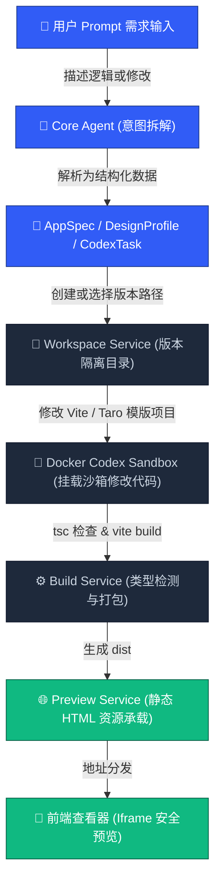

# Atoms-CP ｜ 新一代 Prompt-to-App AI 协同创作工坊

<p align="left">
  <a href="https://react.dev"></a>
  <a href="https://vitejs.dev"></a>
  <a href="https://typescriptlang.org"></a>
  <a href="https://www.docker.com"></a>
  <a href="https://pnpm.io"></a>
  
</p>

`Atoms-CP` 是一个由 AI 驱动的低代码应用生成平台，旨在将用户的自然语言（Prompt）精准转化为高品质、生产级的响应式 Web 应用及多端小程序。用户不仅可以与 AI 协同对话进行持续迭代，还可以通过可视化界面微调选择器直接修改页面元素，并支持多版本快照回退、GitHub 推送、以及一键多渠道部署。

---

## 🏗️ 核心业务架构

平台抛弃了低效、重度依赖内存的 WebContainer 方案，采用了 **“宿主机持久化工作区（Workspace） + 隔离沙箱（Docker Codex） + 静态快照服务（Preview Service）”** 的现代化云原生架构。

### 🔄 应用生成与迭代生命周期



* **核心解析**：Core Agent 智能分析用户需求，提炼成核心的 `AppSpec`（应用规范）和 `CodexTask`（代码微调任务）。
* **工作区隔离**：`Workspace Service` 在宿主机为每个项目及每次迭代版本创建隔离的工作文件夹，天然支持多版本回退。
* **安全沙箱构建**：将生成的代码放入受限的 `Docker` 沙箱容器中运行 `Codex`，隔离宿主机系统权限，保护运行时环境安全。
* **极速静态预览**：`Build Service` 编译输出静态 `dist` 文件，由专用的 `Preview Service` 负责轻量化托管，工作台直接以 `iframe` 安全呈现，彻底免除启动繁重 Node 进程的开销。

---

## 📂 仓库项目结构

项目基于 `pnpm workspaces` 构建，包含三个核心应用子包（Apps）与五个共享工具及模版包（Packages）：

| 目录与模块 | 作用与功能职责 | 技术栈特征 |
| :--- | :--- | :--- |
| **`apps/web`** | 🎨 前端协同工作台 | React 18, Vite, Vanilla CSS, Lucide Icons |
| **`apps/api`** | 🔌 后端 API 主控服务器 | Node.js, Express, Controller-Service 架构 |
| **`apps/builder-worker`** | ⚙️ 异步构建与 Codex 沙箱 Worker | BullMQ, Redis, Docker 命令行封装 |
| **`packages/shared`** | 📦 跨端通用逻辑与类型定义 | TypeScript, Zod Schema |
| **`packages/codegen`** | 🤖 AST 代码分析与修改生成器 | Babel parser, Generator |
| **`packages/templates`** | 🧩 预设的原子组件及业务模版库 | React CSS-in-JS / Vanilla |
| **`packages/generated-app-template`** | 🌐 待生成的 Web 应用脚手架模板 | React 18, Vite, TypeScript |
| **`packages/generated-taro-template`** | 📱 待生成的小程序脚手架模板 | Taro CLI, React |

---

## ⚡ 核心技术栈

* **前端交互层**：
  * **框架基石**：React 18 / TypeScript / Vite 5.x
  * **视觉系统**：Vanilla CSS。重构了极高质感的现代 UI 组件（如**极光毛玻璃微光弹窗**、**不对称聊天泡泡**、**圆润 Composer Capsule 输入胶囊**、以及**呼吸灯状态指示器**），使用平滑的 Apple 级 `cubic-bezier(0.16, 1, 0.3, 1)` 缓动曲线。
* **后端与分布式队列**：
  * **主干逻辑**：Express / Node.js
  * **分布式队列**：`BullMQ`，配合高性能 `Redis` 完成任务调配、状态观察和重试兜底。
* **编译与容器环境**：
  * **环境沙箱**：Docker Sandbox
  * **多端支持**：Vite App 打包与 Taro 多端编译。

---

## 🚀 本地开发快速启动

### 1. 拷贝环境配置
确保本地已安装 Node.js 18+、pnpm 8+ 与 Docker 运行时。
```bash
cp .env.example .env
```

### 2. 初始化依赖安装
```bash
pnpm install
```

### 3. 一键启动所有开发进程
在 Workspace 体系下，您可以利用以下命令并行或单独拉起各开发子项：

```bash
# 启动前端工作台开发服务器 (端口: 5173)
pnpm --filter @atoms-cp/web dev

# 启动后端 API 服务 (端口: 18180)
pnpm --filter @atoms-cp/api dev

# 启动异步 Codex 构建 Worker 队列
pnpm --filter @atoms-cp/builder-worker dev
```

---

## 🧪 自动化测试与质量守则

为保证重构与 UI 打磨过程中的工程健壮性，提交或发布前应通过所有质量关卡：

```bash
# 1. 运行全局前端 TypeScript 类型检查
pnpm --filter @atoms-cp/web typecheck

# 2. 执行 Vitest 单元测试 (含 57 个高保真路由与动作拦截测试)
pnpm --filter @atoms-cp/web test

# 3. 跑通全端集成与端到端测试
pnpm -r test

# 4. 执行生产环境打包编译
pnpm --filter @atoms-cp/web build
```

---

## 🔒 安全与脱敏规范

> [!IMPORTANT]
> 平台面向普通非技术人员进行体验设计，在前端代码、系统报错和 DOM 树中设有严格的**开发禁用词屏蔽机制**：

* **严禁向普通用户界面透露**以下词汇：`Codex`、`Docker`、`Vite`、`pnpm`、`dist`、`HMR`、`WebContainer`、`terminal`、`stdout`、`stderr`、`workspace`、`node_modules`。
* **编译报错隔离**：GitHub 代码提交和快照构建出错时，底层详细堆栈（Stack Trace）及宿主机物理绝对路径均会在前端被安全拦截，自动脱敏并优雅转译为用户级友好提示（如：`当前发布条件尚未满足，请按左侧检查项完成配置`）。
